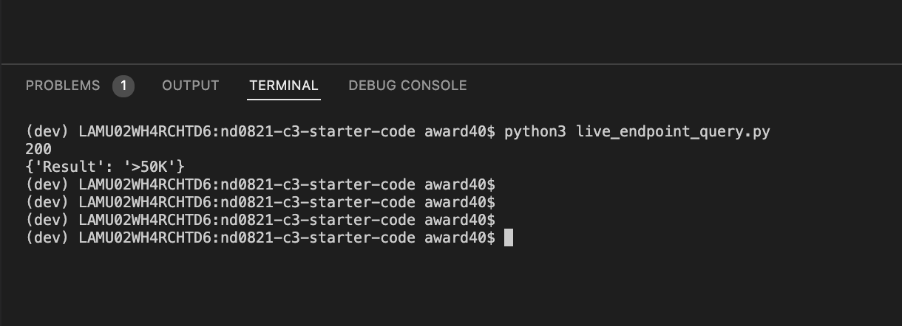

------

This repo contains code for training and deploying a model for classifying whether a person has a salary above or below 50,000. This model is trained on census dats containing certain demographic data (More information here: https://archive.ics.uci.edu/ml/datasets/census+income)

## Requirements
- Run `pip install requirements.txt`

## Modelling
- Model consists of a Random Forest classifier which predicts whether someones salary is above $50,000. For this use case a binary classification approach was taken, whereby a sample showing a probability of 1.0 being positive and 0.0 being negative case.
- run `./starter/train_model.py` to train the model.
- Write model results to `model_card_template.md` to persist details about the model

## API Testing

- For local tests
    - start the API using `uvicorn main:app --reload`
    - query `"http://127.0.0.1:8000"` using the `live_endpoint_query_script.py`
    - You can update the values passed to the model to get differement model outputs.
- For live testing use the
    - query `"https://award40-udacity.herokuapp.com"` using the `live_endpoint_query_script.py`

## Testing
- There are two unit test scripts: `test_app.py` and `test_model.py`
- `test_app.py` contains tests relating to the FastAPI.
- `test_model.py` contains tests ensuring that the code used to preprocess and train the model is working as intended
- Simply running `pytest` in the root folder via your terminal will allow to run the unit tests.
